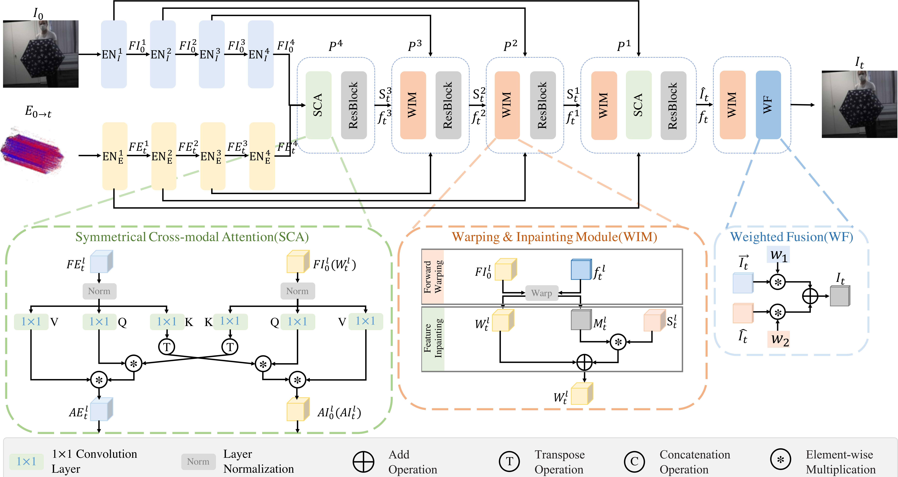

# [AAAI 2024] Video Frame Prediction from a Single Image and Events
<div align='center'>  Juanjuan Zhu*, Zhexiong Wan*, Yuchao Dai† 
</div>
<div align='center'> 
Northwestern Polytechnical University, Xi’an, China
</div>
<div align='center'> 
Shaanxi Key Laboratory of Information Acquisition and Processing
</div>

## Abstract
Recently, the task of Video Frame Prediction (VFP), which predicts future video frames from previous ones through extrapolation, has made remarkable progress.  However, the performance of existing VFP methods is still far from satisfactory due to the fixed framerate video used: 1) they have difficulties in handling complex dynamic scenes; 2) they cannot predict future frames with flexible prediction time intervals. 
The event cameras can record the intensity changes asynchronously with a very high temporal resolution, which provides rich dynamic information about the observed scenes. 
In this paper, we propose to predict video frames from a single image and the following events, which can not only handle complex dynamic scenes but also predict future frames with flexible prediction time intervals.
First, we introduce a symmetrical cross-modal attention augmentation module to enhance the complementary information between images and events. 
Second, we propose to jointly achieve optical flow estimation and frame generation by combining the motion information of events and the semantic information of the image, then inpainting the holes produced by forward warping to obtain an ideal prediction frame.
Based on these, we propose a lightweight pyramidal coarse-to-fine model that can predict a 720P frame within 25 ms.
Extensive experiments show that our proposed model significantly outperforms the state-of-the-art frame-based and event-based VFP methods and has the fastest runtime.
<center>
  <figure>

  </figure>
</center>

## Requirements
* Ubuntu 
* PyTorch 1.13.1
* CUDA 11.7
* python 3.8

build the environment with
```
conda create -y -n VFPSIE python=3.8
pip install torch==1.13.1+cu117 torchvision==0.14.1+cu117 torchaudio==0.13.1 --extra-index-url https://download.pytorch.org/whl/cu117
pip install -r requirements.txt
```

## Quick Usage
Generate a target frame using our model:
```
python run_sample.py  --sample_folder_path  ./sample_data --ckpt_path pretrained_model/VFPSIE.pth --save_output_dir ./output 
```

### Citation
```bibtex
@inproceedings{Zhu_VFPSIE_AAAI_2024,
  title={Video Frame Prediction from a Single Image and Events},
  author={Zhu, Juanjuan and Wan, Zhexiong and Dai, Yuchao},
  booktitle={ AAAI Conference on Artificial Intelligence (AAAI) },
  year={2024},
} 
```

## Acknowledgement
Thanks for the inspiration from the following work:
* [TimeLens: Event-based Video Frame Interpolation](https://github.com/uzh-rpg/rpg_timelens)
* [ESIM: an Open Event Camera Simulator](https://github.com/uzh-rpg/rpg_esim)
* [Video to Events: Recycling Video Datasets for Event Cameras](https://github.com/uzh-rpg/rpg_vid2e)
* [IFRNet: Intermediate Feature Refine Network for Efficient Frame Interpolation](https://github.com/ltkong218/IFRNet)
* [Raft: Recurrent all-pairs field transforms for optical flow](https://github.com/princeton-vl/RAFT)


